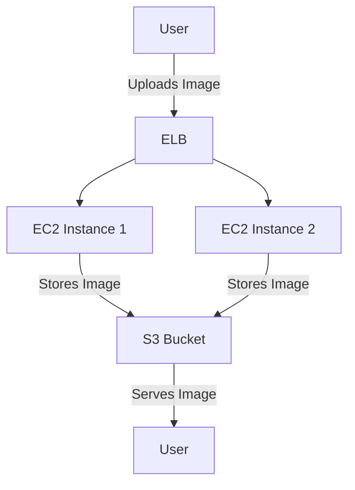

# Image Processing Application

### Fuad Hassan

### Oct 22, 2024

**Overview**: This project involves developing an image processing web application using Django, with AWS services integrated to enhance scalability and reliability. The application allows users to upload images, apply filters, and store processed images. The primary AWS services utilized include EC2 instances to host the application, an S3 bucket for storage, and an Elastic Load Balancer (ELB) to manage incoming traffic for high availability.

### **System Architecture**

1. **User Uploads Image**: Users upload images through the web interface, built with Django.

2. **Image Processing Options**: Users can choose to apply filters such as grayscale, sepia, or blur to the uploaded images.

3. **AWS S3 for Storage**: Instead of storing images locally, both original and processed images are uploaded directly to an AWS S3 bucket.

4. **AWS EC2 Instances for Hosting**: The Django application runs on multiple EC2 instances for redundancy.

5. **Elastic Load Balancer**: ELB distributes incoming requests across multiple EC2 instances to ensure high availability and balanced traffic

Diagram:

### **Steps Involved in Development**:

1. **Django Application Setup**:

   - Created a Django project named "ImageProcessor". Added an application module (image_app) to manage image uploading, processing, and filter selection

2. **AWS S3 Integration**:

   - Created an S3 bucket `(fuad-image-bucket)` to store images. - Configured the settings.py file to use DEFAULT_FILE_STORAGE provided by `storages.backends.s3boto3.S3Boto3Storage` for storing images in S3.

3. **EC2 Setup**:

   - Launched EC2 instances running Amazon Linux 2 to host the Django application.
   - Deployed the application using Gunicorn as the WSGI server `(gunicorn --bind 0.0.0.0:8000 ImageProcessor.wsgi)`.

4. **Elastic Load Balancer (ELB) Configuration**:
   - Created an ELB to distribute incoming traffic across multiple EC2 instances.

### **Function and File Descriptions**

`views.py` (located in `image_app`):

- `upload_image(request):` Handles image upload requests from users. Once an image is uploaded, it is saved to AWS S3. Users are then redirected to a filter selection page.

- `select_filter(request, image_name):` Allows users to apply filters (grayscale, sepia, blur) to the uploaded image. The selected filter is applied, and the processed image is saved back to S3 under the processed folder.

- `view_image(request, image_name):` Displays the processed image by generating a URL from the S3 bucket.

`filters.py` (located in `image_app`):

- `apply_gray_filter(image):` Applies a grayscale filter to the given image using Pillow.

- `apply_sepia_filter(image):` Applies a sepia tone to the image by mapping RGB values to sepia tones.

- `apply_blur_filter(image):` Applies a blur effect using Pillow’s built-in blur filter.

`forms.py` (located in `image_app`):

- `ImageUploadForm:` A Django form for users to upload images. Ensures proper handling and validation of uploaded files.

`settings.py:`

- Configures the settings for the Django project, including AWS integration using storages and boto3. Contains AWS credentials, storage settings, and configuration for connecting to S3.

`urls.py:`

- Defines URL patterns and maps them to corresponding views in views.py. Ensures users can navigate between the upload page, filter selection, and image view.

`wsgi.py:`

- Acts as an entry point for the WSGI-compatible web servers to serve the Django application. Configured to run the application on EC2 instances using Gunicorn.

### **URLS and Web**:

- ELB DNS: `http://imageprocessingapplicationelb2-185435541.us-east-1.elb.amazonaws.com/`
